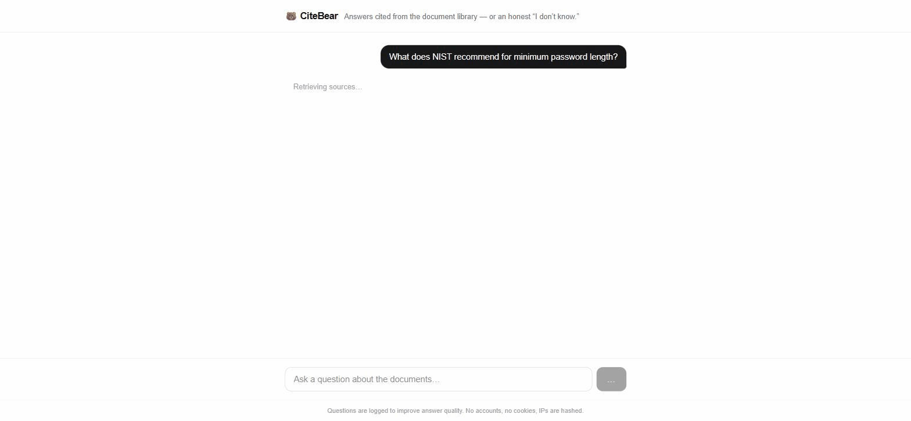
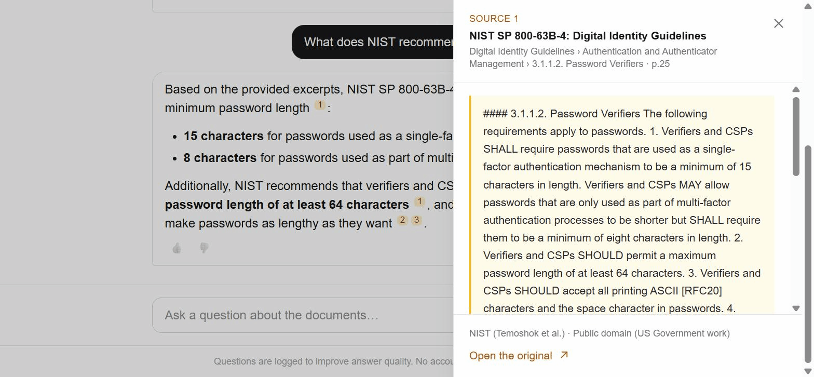
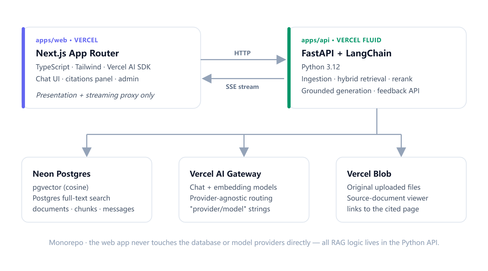

<p align="center">
  
</p>

<p align="center">
  <a href="https://github.com/sablekit/citebear/actions/workflows/ci.yml"></a>
  <a href="https://securityscorecards.dev/viewer/?uri=github.com/sablekit/citebear"></a>
  <a href="LICENSE"></a>
</p>

<p align="center">
  <b>Try it live → <a href="https://citebear.com">citebear.com</a></b>
</p>

> A source-cited RAG chatbot that never makes things up.

CiteBear answers questions over a document library, **cites every claim back to
the exact page**, streams token-by-token like ChatGPT, and says *"I don't know"*
instead of guessing. It is a full-stack reference implementation of the two
things clients actually ask a RAG system to do: source-cited document Q&A, and a
support bot over a corpus of docs.

<p align="center">
  
</p>

Every citation is traceable: click a `[n]` marker and the exact passage opens,
highlighted, page-deep-linked to the original, with its license and authors.

<p align="center">
  
</p>

## Features

- **Citations to the exact page** — every answer traces each claim to a source
  document and section; clicking a marker opens the highlighted passage.
- **Hybrid retrieval + reranking** — semantic (pgvector) and keyword
  (Postgres full-text) search fused with RRF, then a listwise LLM rerank.
- **Grounded-only answers** — the model answers from retrieved context or
  refuses; low-confidence retrieval is flagged in the UI, not papered over.
- **Streaming** — answers stream token-by-token; citation chips appear before
  the first word is written.
- **Self-serve ingestion** — upload PDF / DOCX / Markdown; structure-preserving
  chunking keeps page ranges and the section trail on every chunk.
- **Admin surface** — document management, a question log, and 👍/👎 feedback
  stats over the support-bot story.
- **Provider-agnostic** — models are `provider/model` strings through a gateway;
  switch between Claude, GPT, and others without a code change.

## Architecture

<p align="center">
  
</p>

A pnpm/uv monorepo with a hard boundary: the web app is presentation and a
streaming proxy; **all RAG logic lives in the Python API**. The web tier never
touches the database or a model provider directly.

- **`apps/web`** — Next.js (App Router, TypeScript, Tailwind, Vercel AI SDK).
  Chat UI, citation panel, admin, and an SSE proxy that keeps the API origin
  and its keys private.
- **`apps/api`** — FastAPI + LangChain (Python 3.12). Ingestion, hybrid
  retrieval, reranking, grounded generation, feedback.
- **Storage** — Neon Postgres (pgvector + full-text) for chunks and messages;
  Vercel Blob for original files so the citation viewer can link to the source.

See [`docs/SPEC.md`](docs/SPEC.md) for the full design.

## Design notes

The decisions a reader is most likely to question, and why they went the way
they did.

### Why hybrid retrieval

Dense vector search matches meaning but misses exact tokens — a part number, an
error code, a flag like `--install`. Keyword search nails those literals but
misses paraphrase. Real questions need both, so retrieval runs a vector search
(pgvector cosine) and a keyword search (Postgres `websearch_to_tsquery` +
`ts_rank`) **in parallel**, each returning its own top 20.

### Why reciprocal rank fusion

Vector distances and text-rank scores live on incomparable scales, so you can't
just add them. RRF fuses by **rank, not score** — each result contributes
`1/(k + rank)` from each list (`k = 60`) — which is scale-free and needs no
tuning per query. The fused top 12 go to the reranker.

### Why a rerank stage

Fusion is cheap and recall-oriented; it over-includes. A single **listwise** LLM
rerank call scores the 12 candidates together and keeps the top 5 — one call,
not one-per-chunk. The rerank scores also drive confidence: a weak best-score
means low-relevance retrieval, which is surfaced (or refused) rather than
dressed up as a confident answer.

### Why it refuses

A support bot that invents a number is worse than one that admits a gap. When
the best reranked score is below the floor, CiteBear **refuses without calling
the generator at all**; in the middle band it answers but flags low confidence.
A post-generation check strips any citation marker the model emits that doesn't
map to a retrieved chunk, so a citation never points at nothing.

### Why structure-preserving chunking

Chunks are cut on document structure, not a fixed character window: a shared
heading-stack fold turns the parsed block stream into sections, and every chunk
carries its page range and section trail (`Guidelines › Authentication ›
Password Verifiers`). That trail is what makes a citation legible — and it's
embedded with the chunk so a continuation fragment still retrieves in context.

### Why no LCEL chains

LangChain earns its place at the component layer — loaders, splitter base
classes, the embeddings interface. But the pipeline itself
(retrieve → fuse → rerank → generate) is **plain, typed Python functions**, not
LCEL chains. Heavy chain abstractions obscure control flow and error handling in
exactly the code a reader most needs to follow; explicit orchestration is easier
to test and easier to read.

## The preloaded library

The public instance ships a small, license-clean library so a visitor can ask
real questions without uploading anything. Only works free of NC/ND restrictions
are eligible.

| Document | Authors | License |
|---|---|---|
| [Calibre User Manual](https://manual.calibre-ebook.com/calibre.pdf) | Kovid Goyal | GPL-3.0-only |
| [The Debian Administrator's Handbook](https://debian-handbook.info/download/buster/debian-handbook.pdf) | Raphaël Hertzog & Roland Mas | GPL-2.0-or-later OR CC-BY-SA-3.0 |
| [NIST SP 800-63B-4: Digital Identity Guidelines](https://nvlpubs.nist.gov/nistpubs/SpecialPublications/NIST.SP.800-63B-4.pdf) | NIST (Temoshok et al.) | Public domain (US Government work) |

## Self-hosting

```bash
pnpm install            # web deps
pnpm dev:web            # Next.js dev server

cd apps/api
uv sync
uv run uvicorn citebear_api.app:app --reload
```

Configuration is env-only and validated at startup (see the `.env.example` in
each app) — missing config fails the boot, not the first request. The API needs
a Postgres database with the `pgvector` extension and an OpenAI-compatible model
gateway; **any Postgres with pgvector works**, Neon is just what the public
instance runs on. See [`docs/SPEC.md`](docs/SPEC.md) §8 for the full variable
list and [`AGENTS.md`](AGENTS.md) for commands and conventions.

## Development workflow

CiteBear is built spec-first with an AI-assisted workflow (Claude Code): the
[spec](docs/SPEC.md) precedes the code and is amended before it, every change
lands as a reviewed, signed, conventional commit through a pull request with
green CI, and the retrieval pipeline is gated by a golden test set of
question→expected-source pairs. The workflow itself is part of what this
repository demonstrates.

## Maintainer

[Sablekit](https://github.com/sablekit) (Henry Jia)

## License

[MIT](LICENSE)
